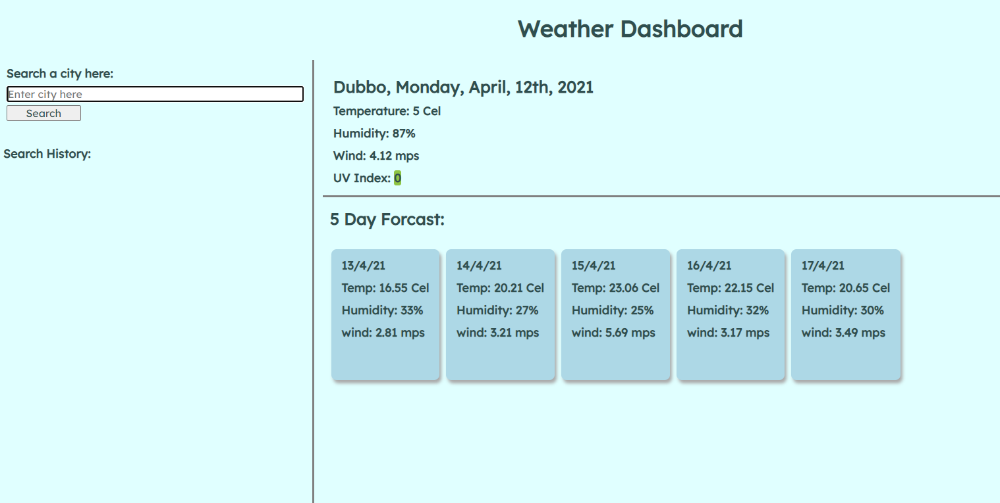

# Weather Dashboard

## Description:

A weather dashboard that allows a user to search a city and get back:

- The city Name, date & time, an icon representing the weather conditions, the temperature, humidity, wind speed and UV index.
    - The UV index changes colour depending on how high it is (Higher numbers move to red and lower numbers move to green).
- The user is also presented with a 5-day forcast for the city searched.

The user is also presented with a search history of recent searches. The searches can be selected to bring
up the weather information for that city and it 5 day forcast.

***

## Screenshoot of website:

***

## Link to live website:

- [Weather Dashboard](https://richardthopkins.github.io/Weather-Dashboard/)

